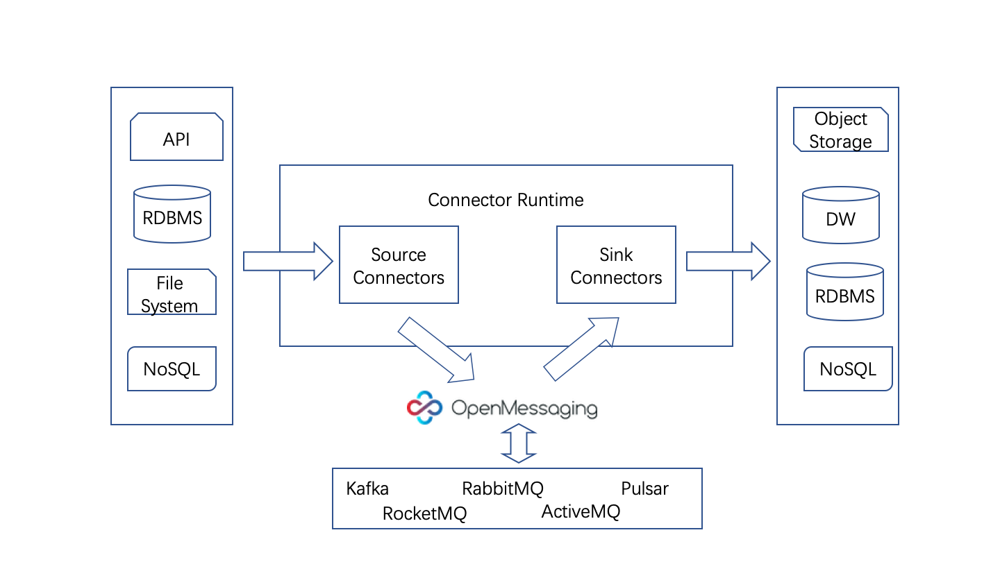

# OpenMessaging Connector

## Introduction
OpenMessaging Connect is a standard to connect between data sources and data destinations. Users could easily create connector instances with configurations via REST API.

There are two types of connectors: source connector and sink connector. A source connector is used for pulling data from a data source (e.g. RDBMS).
The data is sent to corresponding message queue and expected to be consumed by one or many sink connectors.
A sink connector receives message from the queue and loads into a data destination (e.g. data warehouse).
Developers should implement source or sink connector interface to run their specific job.

Usually, connectors rely on a concrete message queue for data transportation. The message queue decouples source connectors from sink connectors.
In the meantime, it provides capabilities such as failover, rate control and one to many data transportation etc.
Some message queues (e.g. Kafka) provide bundled connect frameworks and a various of connectors developed officially or by the community.
However, these frameworks are lack of interoperability, which means a connector developed for Kafka cannot run with 
RabbitMQ without modification and vice versa.

A connector follows OpenMessaging Connect could run with any message queues which support OpenMessaging API.
OpenMessaging Connect provides a standalone runtime which uses OpenMessaging API for sending and consuming message,
as well as the key/value operations for offset management.

## Connector

Connector life cycle:

`onStart(KeyValue config)`
 When the connector starts. Do initialization here.
        

`onPause()`
 When connector is paused by REST api. Good place to release any resources.

`onStop()`
 When connector is stopped before restart.

`onFailed(Exception e)`
 When connector encounters error.

`onDestroyed()` 
 When connector is to be deleted.

### Source connector
`Collection<Message> poll()`
 Messages to be sent.

### Sink connector
`Collection<Message> put()`
 Messages received either by pushConsumer or pollConsumer.

## Connector Runtime
Connector Runtime manages the lifecycle of connectors. Besides the standalone runtime, OpenMessaging Connect is evaluating the feasibility to incorporate popular resource management frameworks like YARN.  

## REST API

Connector Runtime provide a set of REST API for managing and monitoring connectors. 

POST /connectors/{connector name}
*Create connector with configurations.*

GET /connectors/{connector name}
*Get connector's configurations.*

GET /connectors/{connector name}/status
*Get connector's status.*

PUT /connectors/{connector name}/pause
*Pause connector. This will block pushing or receiving of connectors.*

PUT /connectors/{connector name}/resume
*Resume connector.*

POST /connectors/{connector name}/restart
*Restart connector.*
   
DELETE /connectors/{connector name}
*Delete connector.*
